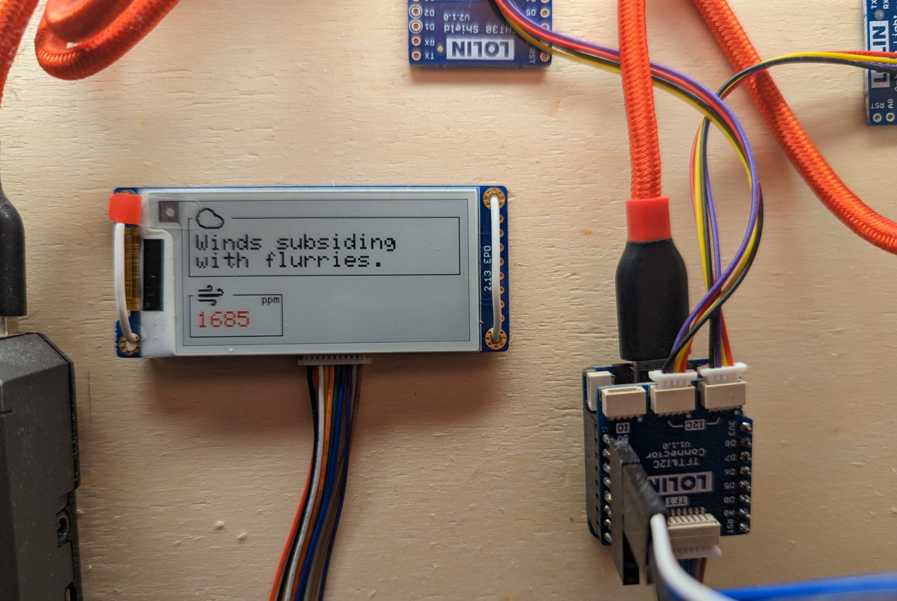
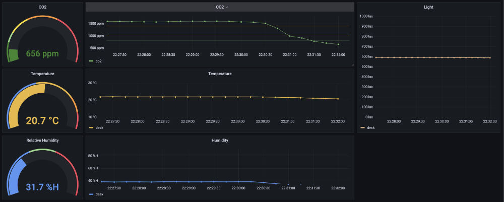

# Status display and air quality monitoring (e.g. CO2, Temperature, Humidity, ...) with an ESP32/ESP8266 

**IMPORTANT NOTICE: This is designed for personal use. USE AT YOUR OWN DISCRETION.**

This is the code for a little side project of mine. It utilises a little ESP8266/ESP-C3 Board to collect data from sensors, send it to a Raspberry Pi and display some key information on a display. The data is sent via MQTT to a Raspberry Pi, where it is stored, monitored and visualized.

Currently, the project uses an E-Paper display to show the current CO2 value and information about the weather:


The data is ingested via [Telegraf](https://github.com/influxdata/telegraf) from a [Mosquitto Server](https://mosquitto.org) into a [Prometheus Database](https://prometheus.io). The data can then be monitored and visualised in Grafana:


Feel free to use this project as an inspiration for your own ESP Project. Be aware that I coded this as a side project, so the Code Quality is not outstanding.

## Wiring / Pins Used

### I2C Sensors, Display: Light Sensor, SHT30, SGP30, HP303B 
- D1 to SCL (Clock Signal)
- D2 to SDA (Data Signal)
- GND to GND
- 3.3V to 3.3V

### CO2
- 5V to G+
- GND (Ground) to G0
- D4 to UART_TxD
- D3 to UART_RxD (beware: in software these are swapped, because receive pin (RX) of slave needs to be connected to send pin of master (TX))

### ePaper
- GND to EPD_GND
- 3.3V to 3.3V
- RST to EPD_RST
- D0 to EPD_CS 
- D8 to EPD_DC (Data / Command Pin) 
- D5 to EPD_CLK
- D7 to EPD_MOSI

## Sensor and Hardware Used

Most of the sensors / hardware are from Lolin. 
- [Lolin D1 Mini V4](https://www.wemos.cc/en/latest/d1/d1_mini.html)
- [ePaper Display](https://www.wemos.cc/en/latest/d1_mini_shield/epd_2_13.html)
- [SGP30](https://www.wemos.cc/en/latest/d1_mini_shield/sgp30.html)
- [SHT30](https://www.wemos.cc/en/latest/d1_mini_shield/sht30.html)
- [Ambient Light](https://www.wemos.cc/en/latest/d1_mini_shield/ambient_light.html)
- [Barometric Pressure](https://www.wemos.cc/en/latest/d1_mini_shield/barometric_pressure.html)
- senseAir S8 CO2 Sensor


## Security

This project was designed with a secure and private Wi-Fi in mind. This project was NOT designed for a network with malicious actors.

A malicious actor in your network could see all data that is logged, manipulate this data and change the text of the display. All communication is unencrypted and is only protected by your WPA Encryption. 


## CLion as IDE

Update project metadata using (necessary whenever you add a library and you want your auto completion to work):
```bash
pio project init --ide clion
```

## Creating and Using an image for your display

If you want to create a custom image, like the one I'm using, you can do this one or two ways:
- Create an image in BMP (bitmap) format and save it to an SD card or the flash memory. Then read it from there and display it. [How to do this](https://learn.adafruit.com/preparing-graphics-for-e-ink-displays/overview)
- Or the simpler way (but not really scalable): Transform the image into a bitmap and save that in your code. 

I'm using the second way. You can take a look at `include/Bitmaps.h` for an example.

### Creating a bitmap and then saving it to code

1. Create an image with the exact pixel height and width (of your display) in your photo editing software of your choice.
2. Export it to `.jpg`
3. Transform it with this [neat little online tool](https://javl.github.io/image2cpp/)
4. Paste it in your code


### Notes for Affinity Designer 

If you're using Affinity Designer I recommend the following settings:
- `Pixels` View Mode
- `Force Pixel Alignment`

The icons used in the image are from [Feather Icons](https://feathericons.com/).